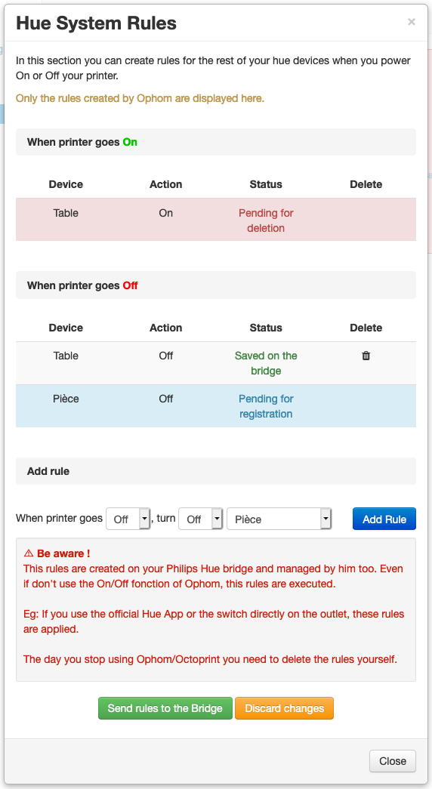

# Ophom

### Automatic Shudown

Switch a Philips Hue that your printer is connected to ON or OFF You can set an automatic switch-off based on a minimum temperature.

The Philips Hue bridge have an internal clock. Ophom can create à delayed power off for a conventional shutdown of the system (eg: Raspberry Pi powered by printer PSU)

### Security Shudown

There are different security option for cuting power in case there is a problem:
- If the data connection to the printer is lost
- If an ermegency stop (M112 GCODE) is send to the printer
- If a maximum temperature is reached by the nozzle or the bed

### Hue Sytem Rules

You can create rules on your Bridge for automatic power on/off other Hue devices at the same time your change the state of your plug.

*This rules are not controlled by Ophom but directly by the Philips Hue Bridge*

## Setup

Install via the bundled [Plugin Manager](https://docs.octoprint.org/en/master/bundledplugins/pluginmanager.html)
or manually using this URL:

    https://github.com/Salamafet/ophom/archive/master.zip

## Configuration

After the installation go to the plugin configuration and follow the guide.

[**ℹ️ Follow this instruction if your USB plug is powering your motherboard print**](https://github.com/Salamafet/ophom/blob/master/docs/usb_avoid_power.md)
