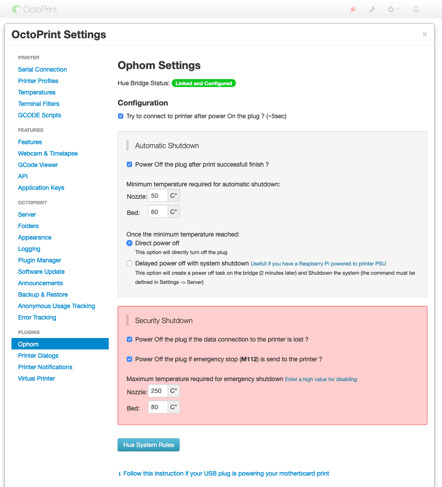

# Ophom

Switch the Philips Hue socket on or off to which your printer is connected  
You can set an automatic switch-off to a minimum temperature of your choice

[**ℹ️ Follow this instruction if your USB plug is powering your motherboard print**](https://github.com/Salamafet/ophom/blob/master/docs/usb_avoid_power.md)

## Setup

Install via the bundled [Plugin Manager](https://docs.octoprint.org/en/master/bundledplugins/pluginmanager.html)
or manually using this URL:

    https://github.com/Salamafet/ophom/archive/master.zip

## Configuration

After the installation go to the plugin configuration and follow the guide.

