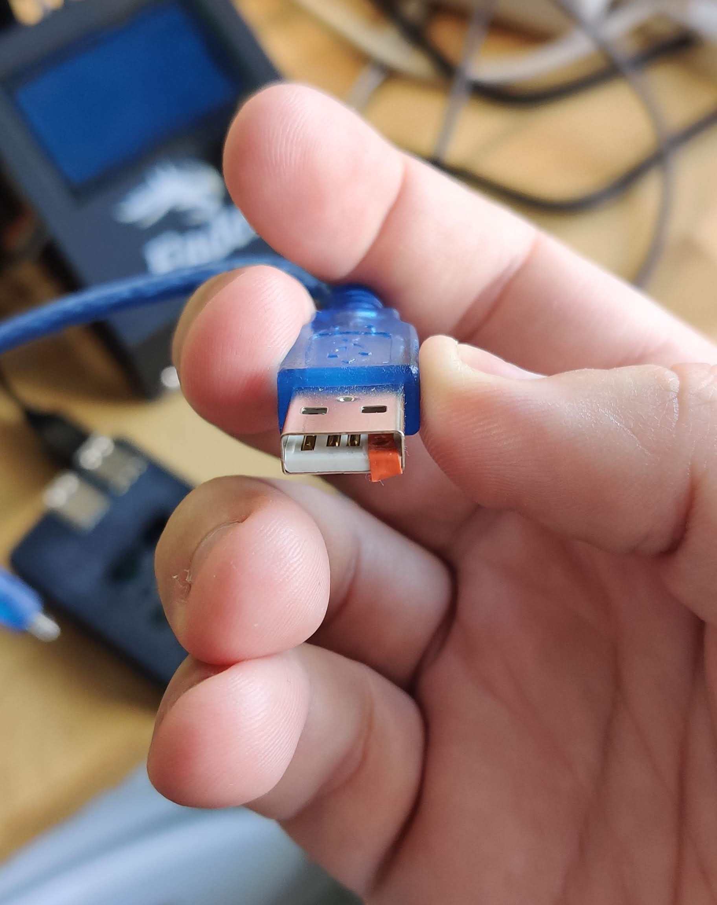

## How to easily prevent the USB plug from powering the printer motherboard

With just a piece of tape you can prevent the USB plug from powering the motherboard of your 3D printer.

To do this, you must obstruct one of the pins of the USB socket. 

### ⚠️ DO NOT OBSTRUCT THE GROUND PIN !!

Here my USB socket (Raspberry Pi side):

